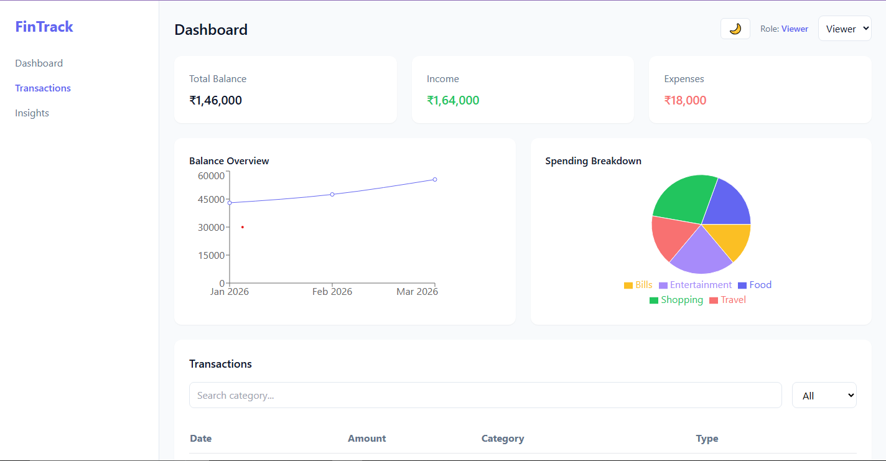
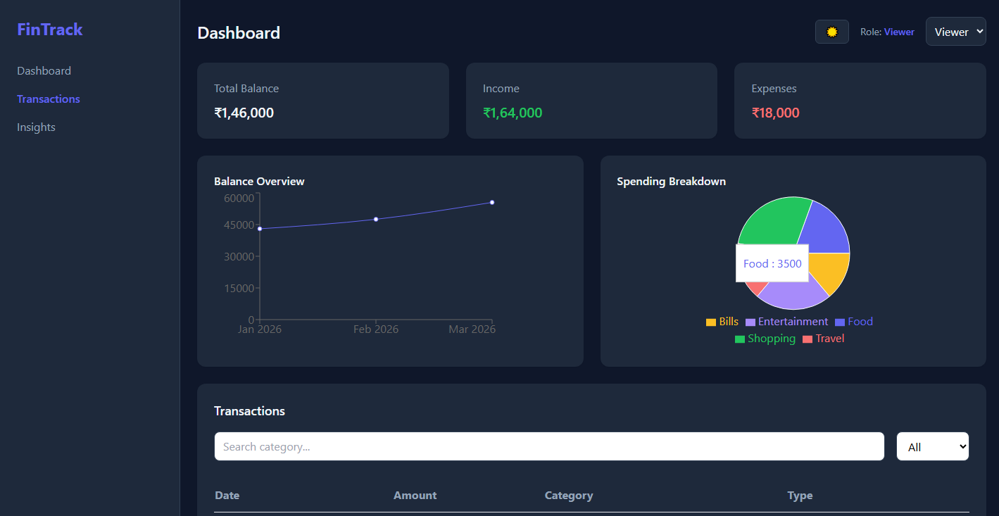
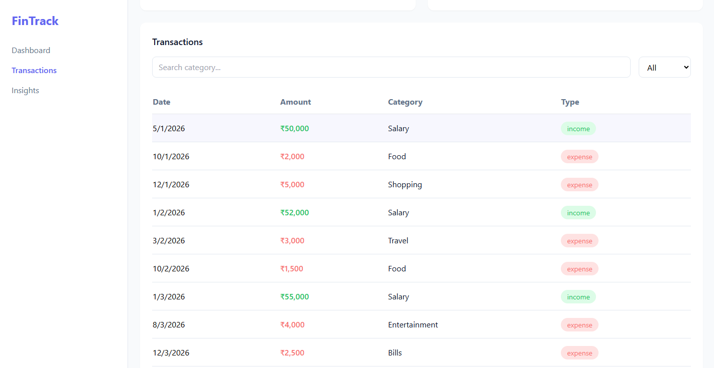

# 💰 Finance Dashboard

## 🌐 Live Demo

Deployed on Vercel: [View Live Demo](https://finance-dashboard-itsj.vercel.app/)

---

A clean, interactive, and responsive finance dashboard built using React.
This project demonstrates modern frontend development practices including state management, data visualization, and intuitive UI/UX design.

## 📸 Screenshots

### 🌞 Light Mode


### 🌙 Dark Mode


### 📊 Transactions


---

## 🚀 Features

- 📊 **Dashboard Overview**
  - Total Balance, Income, and Expenses
  - Real-time calculations from transaction data

- 📈 **Data Visualization**
  - Line chart for monthly balance trends
  - Pie chart for category-wise spending

- 📋 **Transactions Management**
  - Search transactions by category
  - Filter by income/expense
  - Clean and responsive table UI

- 👥 **Role-Based UI**
  - Viewer: Can only view data
  - Admin: Can add transactions

- ➕ **Add Transaction**
  - Modal-based input form
  - Updates UI instantly without refresh

- 💡 **Smart Insights**
  - Highest spending category
  - Total income vs expenses
  - Savings calculation
  - Dynamic insights based on data

- 📱 **Responsive Design**
  - Works across mobile, tablet, and desktop
  - Adaptive layouts for all sections

---

## 🛠️ Tech Stack

- **Frontend:** React.js
- **Styling:** Tailwind CSS
- **Charts:** Recharts
- **State Management:** React Hooks (useState)

---

## 🧠 Key Highlights

- Derived data calculations (no redundant storage)
- Clean and modular component structure
- Real-time UI updates without backend
- Thoughtful UX decisions (active sidebar, smooth scrolling)
- Focus on simplicity and usability

---

## 📦 Installation & Setup

Clone the repository:

```bash
git clone https://github.com/Dhanyaja/finance-dashboard.git
cd finance-dashboard
```

Install dependencies:

```bash
npm install
```

Run the project:

```bash
npm run dev
```

---

## 🎯 Approach

The focus of this project was to build a clean and intuitive dashboard while maintaining simplicity.
Instead of over-engineering, emphasis was placed on:

- Clear data flow
- Reusable components
- Real-world UI/UX patterns
- Meaningful insights from data

---

## 📌 Notes

This project uses mock data and frontend state to simulate real-world behavior without a backend.

---

## 🙌 Author

Dhanyaja Chakram
